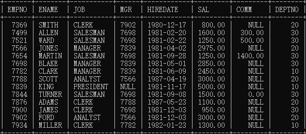
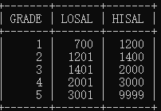
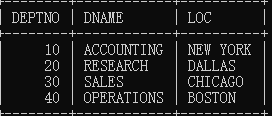
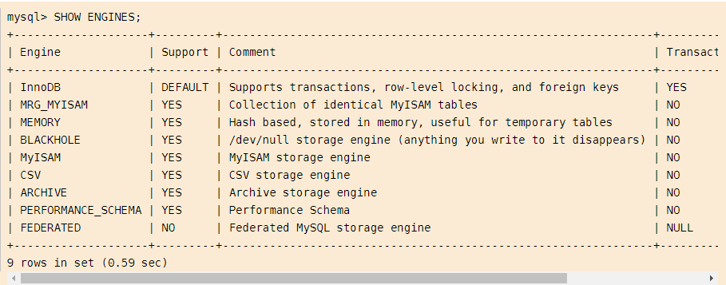
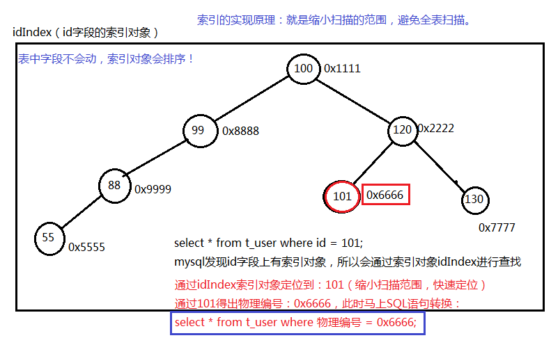

# mysql

## 0.数据库常见概念

### 0.1概念

**数据库：**
		英文单词DataBase，简称DB。按照一定格式存储数据的一些文件的组合。
		顾名思义：存储数据的仓库，实际上就是一堆文件。这些文件中存储了
		具有特定格式的数据。

**数据库管理系统：**
	DataBaseManagement，简称DBMS。
	数据库管理系统是专门用来管理数据库中数据的，数据库管理系统可以
	对数据库当中的数据进行增删改查。

**常见的数据库管理系统：**
	MySQL、Oracle、MS SqlServer、DB2、sybase等....

**SQL：结构化查询语言**
	程序员需要学习SQL语句，程序员通过编写SQL语句，然后DBMS负责执行SQL
	语句，最终来完成数据库中数据的增删改查操作。

SQL是一套标准，程序员主要学习的就是SQL语句，这个SQL在mysql中可以使用，
同时在Oracle中也可以使用，在DB2中也可以使用。

**三者之间的关系？**
	DBMS--执行--> SQL --操作--> DB

先安装数据库管理系统MySQL，然后学习SQL语句怎么写，编写SQL语句之后，DBMS
对SQL语句进行执行，最终来完成数据库的数据管理。

### 0.2 SQL语句分类

**DQL：**
		数据查询语言（凡是带有select关键字的都是查询语句）
		select...		

**DML：**
			数据操作语言（凡是对表当中的数据进行增删改的都是DML）
			insert delete update
			insert 增
			delete 删
			update 改

​		这个主要是操作表中的数据data。

**DDL：**
		数据定义语言
		凡是带有create、drop、alter的都是DDL。
		DDL主要操作的是表的结构。不是表中的数据。
		create：新建，等同于增
		drop：删除
		alter：修改
		这个增删改和DML不同，这个主要是对表结构进行操作。

**TCL：**
	不是王牌电视。
	是事务控制语言
	包括：
		事务提交：commit;
		事务回滚：rollback;

**DCL：**
	是数据控制语言。
	例如：授权grant、撤销权限revoke....

### 0.3MYSQL中的数据类型

**varchar(最长255)**
		**可变长度的字符串**，比较智能，节省空间。会根据实际的数据长度动态分配空间。

​		优点：节省空间
​		缺点：需要动态分配空间，速度慢。

**char(最长255)**
		**定长字符串**，不管实际的数据长度是多少，分配固定长度的空间去存储数据。
		使用不恰当的时候，可能会导致空间的浪费。

​		优点：不需要动态分配空间，**速度快。**
​		缺点：使用不当可能会导致空间的浪费。

​		**varchar和char我们应该怎么选择？**
​			性别字段你选什么？因为性别是固定长度的字符串，所以选择char。
​			姓名字段你选什么？每一个人的名字长度不同，所以选择varchar。

**int(最长11)**

​		数字中的整数型。等同于java的int。

**bigint**
		数字中的长整型。等同于java中的long。

**float**
		单精度浮点型数据

**double**
		双精度浮点型数据

**date**
		短日期类型

**datetime**
		长日期类型

**clob**
		字符大对象
		最多可以存储4G的字符串。
		比如：存储一篇文章，存储一个说明。
		超过255个字符的都要采用CLOB字符大对象来存储。
		Character Large OBject:CLOB

**blob**
		二进制大对象
		Binary Large OBject
		专门用来存储图片、声音、视频等流媒体数据。
		往BLOB类型的字段上插入数据的时候，例如插入一个图片、视频等，
		你需要使用IO流才行。

```sql
t_movie 电影表（专门存储电影信息的）
编号no(bigint)	名字name(varchar)		故事情节history(clob)	
上映日期playtime(date)		时长time(double)		海报image(blob)
类型type(char)							
```

### 0.4SQL脚本的执行

xxxx.sql这种文件被称为sql脚本文件。
		sql脚本文件中编写了大量的sql语句。
		我们执行sql脚本文件的时候，该文件中所有的sql语句会全部执行！
		批量的执行SQL语句，可以使用sql脚本文件。

- mysql> source D:\course\03-MySQL\document\vip.sql
  你在实际的工作中，第一天到了公司，项目经理会给你一个xxx.sql文件，你执行这个脚本文件，你电脑上的数据库数据就有了！

### 0.5数据库和表的导入导出

```sql
数据导出？
	注意：在windows的dos命令窗口中：
		mysqldump bjpowernode>D:\bjpowernode.sql -uroot -p123456
	可以导出指定的表吗？
		mysqldump bjpowernode emp>D:\bjpowernode.sql -uroot -p123456

数据导入？
	注意：需要先登录到mysql数据库服务器上。
	然后创建数据库：create database bjpowernode;
	使用数据库：use bjpowernode
	然后初始化数据库：source D:\bjpowernode.sql
```

## 1.数据库操作

**show databases;** 	查看mysql中有哪些数据库

 **use test;**	表示正在使用一个名字叫做test的数据库。

 **create database db01;**	创建数据库

**show tables;** 	查看某个数据库下有哪些表

 **select version();**	查看mysql数据库的版本号

**select database();**	查看当前使用的是哪个数据库

**\c**	用来终止一条命令的输入。

## 2.建表操作

### 2.1创建一个表create

```sql
学号、姓名、年龄、性别、邮箱地址
	create table t_student(
		no int,
		name varchar(32),
		sex char(1),
		age int(3),
		email varchar(255)
	);
```

### 2.2删除一个表drop

```sql
	drop table t_student; // 当这张表不存在的时候会报错！
	// 如果这张表存在的话，删除
	drop table if exists t_student;
```

- 对表结构的修改需要使用：**alter**属于DDL语句
- **desc** t_student    查看表结构

### 2.3插入数据insert

- insert into 表名(字段名1,字段名2,字段名3...) values(值1,值2,值3);

```sql
insert into t_student(no,name,sex,age,email)
	values(1,'zhangsan','m',20,'zhangsan@123.com');
insert into t_student(email,name,sex,age,no)
	values('lisi@123.com','lisi','f',20,2);
insert into t_student(no) values(3);
//省略字段名
insert into t_student values(2, 'lisi', 'f', 20, 'lisi@123.com');
```

- insert语句但凡是执行成功了，那么必然会多一条记录。没有给其它字段指定值的话，默认值是NULL。

**一次插入多条数据**

- insert into t_user(字段名1,字段名2) values(),(),(),();

```sql
insert into t_user(id,name,birth,create_time) values
		(1,'zs','1980-10-11',now()), 
		(2,'lisi','1981-10-11',now()),
		(3,'wangwu','1982-10-11',now());
```


### 2.4修改数据update

- update 表名 set 字段名1=值1,字段名2=值2,字段名3=值3... where 条件;

- 没有条件限制会导致所有数据全部更新。

```sql
update t_user set name = 'jack', birth = '2000-10-11' where id = 2;

update t_user set name = 'jack', birth = '2000-10-11', create_time = now() where id = 2;
```

### 2.5删除数据

**delete**语句删除数据的原理？（delete属于DML语句！！！）

- 表中的数据被删除了，但是这个数据在硬盘上的真实存储空间不会被释放！！！
- 这种删除缺点是：删除效率比较低。
- 这种删除优点是：支持回滚，后悔了可以再恢复数据！！！

**truncate**语句删除数据的原理？

- 这种删除效率比较高，表被一次截断，物理删除。
- 这种删除缺点：不支持回滚。
- 这种删除优点：快速。

#### 2.5.1delete

- delete from 表名 where 条件;
- 没有条件，整张表的数据会全部删除！

- delete from t_user where id = 2;

#### 2.5.2truncate 

- truncate table dept_bak; （这种操作属于DDL操作。）


下列演示内容所用表

**emp 员工表**



**salgarde 工资等级表**



**dept 部门表**



## 3.基础增删改


## 3.单表查询


### 3.1基础条件查询

- select  字段1,字段2,字段3....  from   表名  where  条件;

**= 等于**

```sql
查询薪资等于800的员工姓名和编号？
		select empno,ename from emp where sal = 800;
	查询SMITH的编号和薪资？
		select empno,sal from emp where ename = 'SMITH'; //字符串使用单引号
```

**<>或!= 不等于**

```sql
查询薪资不等于800的员工姓名和编号？
	select empno,ename from emp where sal != 800;
	select empno,ename from emp where sal <> 800; // 小于号和大于号组成的不等号
```

**< 小于**  **<= 小于等于**

```sql	
查询薪资小于等于3000的员工姓名和编号？
		select empno,ename,sal from emp where sal <= 3000;
```

**(>)大于 **  ** (>=) 大于等于**

```sql
查询薪资大于等于3000的员工姓名和编号？
select empno,ename,sal from emp where sal >= 3000;

between … and …. 两个值之间, 等同于 >= and <=
查询薪资在2450和3000之间的员工信息？包括2450和3000
	第一种方式：>= and <= （and是并且的意思。）
		select empno,ename,sal from emp where sal >= 2450 and sal <= 3000;	
```

**is null 为 null（is not null 不为空）**

```sql
查询哪些员工的津贴/补助为null？
		mysql> select empno,ename,sal,comm from emp where comm = null;

查询哪些员工的津贴/补助不为null？
		select empno,ename,sal,comm from emp where comm is not null;
```

**and 并且    or 或者**

```sql
select  * from emp where sal > 2500 and (deptno = 10 or deptno = 20);

and和or同时出现，and优先级较高。如果想让or先执行，需要加“小括号”,以后在开发中，如果不确定优先级，就加小括号就行了。
```

**in 包含，相当于多个 or （not in 不在这个范围中）**

```sql
查询工作岗位是MANAGER和SALESMAN的员工？
select empno,ename,job from emp where job = 'MANAGER' or job = 'SALESMAN';
select empno,ename,job from emp where job in('MANAGER', 'SALESMAN');
```

**not 可以取非，主要用在 is 或 in 中**

```sql
is null
is not null
in
not in
```

**like** 	

称为模糊查询，支持%或下划线匹配

- %匹配任意多个字符
- 下划线：任意一个字符。
- （%是一个特殊的符号，_ 也是一个特殊符号）	

```sql

找出名字中含有O的？
	mysql> select ename from emp where ename like '%O%';

找出名字中有“_”的？
	select name from t_student where name like '%_%'; //这样不行。

	mysql> select name from t_student where name like '%\_%'; // \转义字符。
```

**distinct**

- 把查询结果去除重复记录【distinct】
-  distinct只能出现在所有字段的最前方。
- distinct出现在job,deptno两个字段之前，表示两个字段联合起来去重。

- select distinct job from emp;
-  select distinct job,deptno from emp;

### 3.2排序

查询所有员工薪资，排序？

- select  ename,sal from emp order by sal; // 默认是升序！！！

指定降序：**desc**

- select  ename,sal from emp order by sal desc;

```sql
查询员工名字和薪资，要求按照薪资升序，如果薪资一样的话，
	再按照名字升序排列。
	select 
		ename,sal
	from
		emp
	order by
		sal asc, ename asc; // sal在前，起主导，只有sal相等的时候，才会考虑启用ename排序。
```

### 3.3分页

- **limit**作用：将查询结果集的一部分取出来。通常使用在分页查询当中。
  - 完整用法：limit startIndex, length		startIndex是起始下标，length是长度。
  - 起始下标从0开始。
  - 缺省用法：limit 5; 这是取前5.

**按照薪资降序，取出排名在前5名的员工？**

```sql
select 
		ename,sal
	from
		emp
	order by 
		sal desc
	limit 5; //取前5	limit 0,5;
mysql当中limit在order by之后执行！！！！！！
```

**取出工资排名在[3-5]名的员工？**

```sql
	select 
		ename,sal
	from
		emp
	order by
		sal desc
	limit
		2, 3;
2表示起始位置从下标2开始，就是第三条记录。
3表示长度。
```

- 每页显示3条记录
  - 第1页：limit 0,3		[0 1 2]
  - 第2页：limit 3,3		[3 4 5]
  - 第3页：limit 6,3		[6 7 8]

- 每页显示pageSize条记录
  - 第pageNo页：limit (pageNo - 1) * pageSize  , pageSize

## 4.函数

### 4.1单行处理函数

- 单行处理函数的特点：一个输入对应一个输出。
  - 和单行处理函数相对的是：多行处理函数。（多行处理函数特点：多个输入，对应1个输出！）

```sql
lower 转换小写
	mysql> select lower(ename) as ename from emp;
upper 转换大写
		mysql> select * from t_student;
substr 取子串（substr( 被截取的字符串, 起始下标,截取的长度)）
		select substr(ename, 1, 1) as ename from emp;
		注意：起始下标从1开始，没有0.
		找出员工名字第一个字母是A的员工信息？
			第一种方式：模糊查询
				select ename from emp where ename like 'A%';
			第二种方式：substr函数
				select 
					ename 
				from 
					emp 
				where 
					substr(ename,1,1) = 'A';
concat函数进行字符串的拼接
		select concat(empno,ename) from emp;
length 取长度
		select length(ename) enamelength from emp;
trim 去空格
		mysql> select * from emp where ename = '  KING';
str_to_date 将字符串转换成日期
date_format 格式化日期
format 设置千分位
round 四舍五入
		select 字段 from 表名;
		select ename from emp;
		select 'abc' from emp; // select后面直接跟“字面量/字面值”

		mysql> select 'abc' as bieming from emp;
		select round(1236.567, 1) as result from emp; //保留1个小数
		select round(1236.567, 2) as result from emp; //保留2个小数
		select round(1236.567, -1) as result from emp; // 保留到十位。
rand() 生成随机数
		mysql> select round(rand()*100,0) from emp; // 100以内的随机数
ifnull 可以将 null 转换成一个具体值
		ifnull是空处理函数。专门处理空的。
		在所有数据库当中，只要有NULL参与的数学运算，最终结果就是NULL。
		mysql> select ename, sal + comm as salcomm from emp;
```

### 4.2分组函数

- 多行处理函数的特点：输入多行，最终输出一行。
  - count	计数
  - sum	求和
  - avg	平均值
  - max	最大值
  - min	最小值
- 注意：
  	分组函数在使用的时候必须先进行分组，然后才能用。
  	如果你没有对数据进行分组，整张表默认为一组。	

```sql
找出最高工资？
		mysql> select max(sal) from emp;
找出最低工资？
		mysql> select min(sal) from emp;
计算工资和：
		mysql> select sum(sal) from emp;
计算平均工资：
		mysql> select avg(sal) from emp;
计算员工数量？
		mysql> select count(ename) from emp;
```

**分组函数在使用的时候需要注意哪些？**	

- 第一点：分组函数自动忽略NULL，你不需要提前对NULL进行处理。
- 第二点：分组函数中count(*)和count(具体字段)有什么区别？*
  - count(具体字段)：表示统计该字段下所有不为NULL的元素的总数。
  - count(*)：统计表当中的总行数。（只要有一行数据count则++）
    				因为每一行记录不可能都为NULL，一行数据中有一列不为NULL，则这行数据就是有效的。
- 第三点：分组函数不能够直接使用在where子句中。
  			找出比最低工资高的员工信息。
    				select ename,sal from emp where sal > min(sal);
    				表面上没问题，运行一下？
    					ERROR 1111 (HY000): Invalid use of group function

## 5.分组查询

### 5.1 group by

**找出每个工作岗位的工资和？**

```sql
	实现思路：按照工作岗位分组，然后对工资求和。
		select 
			job,sum(sal)
		from
			emp
		group by
			job;
以上这个语句的执行顺序？
先从emp表中查询数据。根据job字段进行分组。然后对每一组的数据进行sum(sal)
```

- 在一条select语句当中，如果有group by语句的话，select后面只能跟：**参加分组的字段，以及**分组函数。其它的一律不能跟。**

**找出每个部门的最高薪资**

```sql
实现思路:按照部门编号分组，求每一组的最大值。
	mysql> select deptno,max(sal) from emp group by deptno;
```

### 5.2 联合分组

**找出“每个部门，不同工作岗位”的最高薪资？**

```sql
技巧：两个字段联合成1个字段看。（两个字段联合分组）
		select 
			deptno, job, max(sal)
		from
			emp
		group by
			deptno, job;


```

### 5.3having

- 使用having可以对分完组之后的数据进一步过滤。

- having不能单独使用，having不能代替where，having必须和group by联合使用。

**找出每个部门平均薪资，要求显示平均薪资高于2500的。**

```sql
select 
	deptno,avg(sal) 
from 
	emp 
group by 
	deptno
having
	avg(sal) > 2500;
```

- where和having，优先选择where，where实在完成不了了，再选择having。

### 5.4总结sql执行顺序

- select  --> from --> where --> group by --> having --> order by -->
  以上关键字只能按照这个顺序来，不能颠倒。

执行顺序？
	1. from --> where --> group by --> having --> select --> order by

1. 从某张表中查询数据，
2. 先经过where条件筛选出有价值的数据。
3. 对这些有价值的数据进行分组。
4. 分组之后可以使用having继续筛选。
5. select查询出来。
6. 最后排序输出！

```sql
找出每个岗位的平均薪资，要求显示平均薪资大于1500的，除MANAGER岗位之外，
要求按照平均薪资降序排。
	select 
		job, avg(sal) as avgsal
	from
		emp
	where
		job <> 'MANAGER'
	group by
		job
	having
		avg(sal) > 1500
	order by
		avgsal desc;
```

## 6.连表查询

- 从一张表中单独查询，称为单表查询
- emp表和dept表联合起来查询数据，从emp表中取员工名字，从dept表中取部门名字。

- 这种跨表查询，多张表联合起来查询数据，被称为连接查询。

select ename,dname from emp, dept;

- 当两张表进行连接查询，没有任何条件限制的时候，最终查询结果条数，是两张表条数的乘积，这种现象被称为：笛卡尔积现象。

### 6.1内连接之等值连接

**查询每个员工所在部门名称，显示员工名和部门名？**

- emp e和dept d表进行连接。条件是：e.deptno = d.deptno

```sql
SQL92语法：
	select 
		e.ename,d.dname
	from
		emp e, dept d
	where
		e.deptno = d.deptno;
	
	sql92的缺点：结构不清晰，表的连接条件，和后期进一步筛选的条件，都放到了where后面。
	
SQL99语法：
	//inner可以省略（带着inner可读性更好！！！一眼就能看出来是内连接）
	select 
		e.ename,d.dname
	from
		emp e
	inner join
		dept d
	on
		e.deptno = d.deptno; // 条件是等量关系，所以被称为等值连接。
	sql99优点：表连接的条件是独立的，连接之后，如果还需要进一步筛选，再往后继续添加where
```

### 6.2内连接之非等值连接

**找出每个员工的薪资等级，要求显示员工名、薪资、薪资等级？**

```sql
select 
	e.ename, e.sal, s.grade
from
	emp e
join
	salgrade s
on
	e.sal between s.losal and s.hisal; // 条件不是一个等量关系，称为非等值连接。
```

### 6.3内连接自己连接

**查询员工的上级领导，要求显示员工名和对应的领导名？**

```sql
技巧：一张表看成两张表。
select 
	a.ename as '员工名', b.ename as '领导名'
from
	emp a
join
	emp b
on
	a.mgr = b.empno; //员工的领导编号 = 领导的员工编号
```

### 6.4外连接

- 内连接：（A和B连接，AB两张表没有主次关系。平等的。）

- 内连接的特点：完成能够匹配上ON后面的条件的数据查询出来。

````sql
// outer是可以省略的，带着可读性强。
select 
	e.ename,d.dname
from
	emp e 
right outer join 
	dept d
on
	e.deptno = d.deptno;
````

- right代表什么：表示将join关键字右边的这张表看成主表，主要是为了将
- 这张表的数据全部查询出来，捎带着关联查询左边的表。
- 在外连接当中，两张表连接，产生了主次关系。

```sql
select 
	e.ename,d.dname
from
	dept d 
left outer join 
	emp e
on
	e.deptno = d.deptno;

带有right的是右外连接，又叫做右连接。
带有left的是左外连接，又叫做左连接。
任何一个右连接都有左连接的写法。
任何一个左连接都有右连接的写法。
```

### 6.5多表连接

**三张表，四张表怎么连接？**

```sql
	语法：
		select 
			...
		from
			a
		join
			b
		on
			a和b的连接条件
		join
			c
		on
			a和c的连接条件
		right join
			d
		on
			a和d的连接条件
```

**找出每个员工的部门名称以及工资等级，要求显示员工名、部门名、薪资、薪资等级？**

```sql
select 
		e.ename,e.sal,d.dname,s.grade
	from
		emp e
	join
		dept d
	on 
		e.deptno = d.deptno
	join
		salgrade s
	on
		e.sal between s.losal and s.hisal;
```

**找出每个员工的部门名称以及工资等级，还有上级领导，要求显示员工名、领导名、部门名、薪资、薪资等级？**


```sql
select 
	e.ename,e.sal,d.dname,s.grade,l.ename
from
	emp e
join
	dept d
on 
	e.deptno = d.deptno
join
	salgrade s
on
	e.sal between s.losal and s.hisal
left join
	emp l
on
	e.mgr = l.empno;
```

## 7.子查询

- select语句中嵌套select语句，被嵌套的select语句称为子查询。

- 子查询可以出现在 select后面，from 后面，where 后面。

### 7.1where子句中的子查询

**找出比最低工资高的员工姓名和工资？**

- select ename,sal from emp where sal > (select min(sal) from emp);

### 7.2from子句中的子查询

- from后面的子查询，可以将子查询的查询结果当做一张临时表。（技巧）

**找出每个岗位的平均工资的薪资等级。**

```sql
select 
			t.*, s.grade
		from
			(select job,avg(sal) as avgsal from emp group by job) t
		join
			salgrade s
		on
			t.avgsal between s.losal and s.hisal;
```

## 8.约束

- 在创建表的时候，我们可以给表中的字段加上一些约束，来保证这个表中数据的完整性、有效性！！！

### 8.1约束类型

- 非空约束：not null
- 唯一性约束: unique
- 主键约束: primary key （简称PK）
- 外键约束：foreign key（简称FK）
- 检查约束：check（mysql不支持，oracle支持）

我们这里重点学习四个约束：**not null，unique，primary key，foreign key。**

### 8.2not null

- 非空约束not null约束的字段不能为NULL。

```sql
drop table if exists t_vip;
	create table t_vip(
		id int,
		name varchar(255) not null  // not null只有列级约束，没有表级约束！
	);
insert into t_vip(id,name) values(1,'zhangsan');

insert into t_vip(id) values(3);
	ERROR 1364 (HY000): Field 'name' doesn't have a default value
```


### 8.3unique

- 唯一性约束unique约束的字段不能重复，但是**可以为NULL**。

```sql
	drop table if exists t_vip;
	create table t_vip(
		id int,
		name varchar(255) unique,
		email varchar(255)
	);
	insert into t_vip(id,name,email) values(2,'lisi','lisi@123.com');
	insert into t_vip(id,name,email) values(3,'wangwu','wangwu@123.com');
	select * from t_vip;

	insert into t_vip(id,name,email) values(4,'wangwu','wangwu@sina.com');
	ERROR 1062 (23000): Duplicate entry 'wangwu' for key 'name'

	insert into t_vip(id) values(4);
	insert into t_vip(id) values(5);
	+------+----------+------------------+
	| id   | name     | email            |
	+------+----------+------------------+
	|    1 | zhangsan | zhangsan@123.com |
	|    2 | lisi     | lisi@123.com     |
	|    3 | wangwu   | wangwu@123.com   |
	|    4 | NULL     | NULL             |
	|    5 | NULL     | NULL             |
	+------+----------+------------------+
	name字段虽然被unique约束了，但是可以为NULL。
```

#### 8.3.1联合唯一

- name和email两个字段联合起来具有唯一性！！！！

```sql
drop table if exists t_vip;
create table t_vip(
	id int,
	name varchar(255),
	email varchar(255),
	unique(name,email) // 约束没有添加在列的后面，这种约束被称为表级约束。
);
insert into t_vip(id,name,email) values(1,'zhangsan','zhangsan@123.com');
insert into t_vip(id,name,email) values(2,'zhangsan','zhangsan@sina.com');
	name和email两个字段联合起来唯一！！！
	
insert into t_vip(id,name,email) values(3,'zhangsan','zhangsan@sina.com');
	ERROR 1062 (23000): Duplicate entry 'zhangsan-zhangsan@sina.com' for key 'name'
```

- 在mysql当中，如果一个字段同时被not null和unique约束的话，该字段自动变成主键字段。（注意：oracle中不一样！）

### 8.4primary key

- 主键值是每一行记录的唯一标识。主键值是每一行记录的身份证号！！！

- 主键的特征：not null + unique（主键值不能是NULL，同时也不能重复！）

```sql
drop table if exists t_vip;
		// 1个字段做主键，叫做：单一主键
		create table t_vip(
			id int primary key,  //列级约束
			name varchar(255),
            primary key(id)  // 表级约束
		);
		insert into t_vip(id,name) values(1,'zhangsan');
		insert into t_vip(id,name) values(2,'lisi');

		//错误：不能重复
		insert into t_vip(id,name) values(2,'wangwu');
		ERROR 1062 (23000): Duplicate entry '2' for key 'PRIMARY'

		//错误：不能为NULL
		insert into t_vip(name) values('zhaoliu');
		ERROR 1364 (HY000): Field 'id' doesn't have a default value
```

#### 8.4.1复合主键

```sql
drop table if exists t_vip;
		// id和name联合起来做主键：复合主键！！！！
		create table t_vip(
			id int,
			name varchar(255),
			email varchar(255),
			primary key(id,name)
		);
insert into t_vip(id,name,email) values(1,'zhangsan','zhangsan@123.com');
insert into t_vip(id,name,email) values(1,'lisi','lisi@123.com');

//错误：不能重复
insert into t_vip(id,name,email) values(1,'lisi','lisi@123.com');
	ERROR 1062 (23000): Duplicate entry '1-lisi' for key 'PRIMARY'
```

- 在实际开发中不建议使用：复合主键。建议使用单一主键！
- 因为主键值存在的意义就是这行记录的身份证号，只要意义达到即可，单一主键可以做到。

```sql
一个表中主键约束能加两个吗？
		drop table if exists t_vip;
		create table t_vip(
			id int primary key,
			name varchar(255) primary key
		);
		ERROR 1068 (42000): Multiple primary key defined
```

- 结论：一张表，主键约束只能添加1个。（主键只能有1个。）

**主键分类**

- 自然主键：主键值是一个自然数，和业务没关系。

- 业务主键：主键值和业务紧密关联，例如拿银行卡账号做主键值。这就是业务主键！

#### 8.4.2主键自增

- 在mysql当中，有一种机制，可以帮助我们自动维护一个主键值

```sql
rop table if exists t_vip;
create table t_vip(
	id int primary key auto_increment, //auto_increment表示自增，从1开始，以1递增！
	name varchar(255)
);
		insert into t_vip(name) values('zhangsan');
		insert into t_vip(name) values('zhangsan');
		insert into t_vip(name) values('zhangsan');
		insert into t_vip(name) values('zhangsan');
		insert into t_vip(name) values('zhangsan');
		insert into t_vip(name) values('zhangsan');
		
		+----+----------+
		| id | name     |
		+----+----------+
		|  1 | zhangsan |
		|  2 | zhangsan |
		|  3 | zhangsan |
		|  4 | zhangsan |
		|  5 | zhangsan |
```

### 8.5foreign key

- 如果一个实体的某个字段指向另一个实体的主键，就称为外键
- 被指向的实体，称之为主实体（主表），也叫父实体（父表）。
- 负责指向的实体，称之为从实体（从表），也叫子实体（子表）

```
create table t_class(
	classno int primary key,
	classname varchar(255)
);
create table t_student(
	no int primary key auto_increment,
	name varchar(255),
	cno int,
	foreign key(cno) references t_class(classno)
);

insert into t_class(classno, classname) values(100, '北京市大兴区亦庄镇第二中学高三1班');
insert into t_class(classno, classname) values(101, '北京市大兴区亦庄镇第二中学高三1班');

insert into t_student(name,cno) values('jack', 100);
insert into t_student(name,cno) values('lilei', 100);
insert into t_student(name,cno) values('hanmeimei', 100);
insert into t_student(name,cno) values('zhangsan', 101);
insert into t_student(name,cno) values('lisi', 101);
```

- 外键可以为空，可以理解成 一名学生肯定会关联到一个存在的班级，但来了一个转校生，还没有分班，他现在属于学生子表，但还没有关联到班级主表中的任何一条记录。

t_class是父表，t_student是子表

​		**删除表**的顺序？	先删子，再删父。

​		**创建表**的顺序？	先创建父，再创建子。

​		**删除数据**的顺序？先删子，再删父。

​		**插入数据**的顺序？先插入父，再插入子

- 子表中的外键引用的父表中的某个字段，被引用的这个字段不一定是主键，但至少具有unique约束。

## 9.存储引擎

- 存储引擎是MySQL中特有的一个术语，其它数据库中没有。（Oracle中有，但是不叫这个名字）
- 实际上存储引擎是一个表存储/组织数据的方式。
- 不同的存储引擎，表存储数据的方式不同。

```sql
show create table t_student;
可以在建表的时候给表指定存储引擎。
CREATE TABLE `t_student` (
  `no` int(11) NOT NULL AUTO_INCREMENT,
  `name` varchar(255) DEFAULT NULL,
  `cno` int(11) DEFAULT NULL,
  PRIMARY KEY (`no`),
  KEY `cno` (`cno`),
  CONSTRAINT `t_student_ibfk_1` FOREIGN KEY (`cno`) REFERENCES `t_class` (`classno`)
) ENGINE=InnoDB AUTO_INCREMENT=11 DEFAULT CHARSET=utf8
```

在建表的时候可以在最后小括号的")"的右边使用：

- ENGINE来指定存储引擎。	mysql默认的存储引擎是：**InnoDB**
- CHARSET来指定这张表的字符编码方式。mysql默认的字符编码方式是：**utf8**

### 9.1mysql支持的存储引擎

- show engines \G   查看mysql支持哪些存储引擎
- mysql支持九大存储引擎，当前5.5.36支持8个。版本不同支持情况不同。



### 9.2MyISAM存储引擎

- 使用三个文件表示每个表：
  - 格式文件 — 存储表结构的定义（mytable.frm）
  - 数据文件 — 存储表行的内容（mytable.MYD）
  - 索引文件 — 存储表上索引（mytable.MYI）：索引是一本书的目录，缩小扫描范围，提高查询效率的一种机制。

- 可被转换为压缩、只读表来节省空间
- MyISAM存储引擎特点：
  - 可被转换为压缩、只读表来节省空间这是这种存储引擎的优势！！！！
  - MyISAM不支持事务机制，安全性低。

### 9.3InnoDB存储引擎

- 这是mysql默认的存储引擎，同时也是一个重量级的存储引擎。
- InnoDB支持事务，支持数据库崩溃后自动恢复机制。
- InnoDB存储引擎最主要的特点是：非常安全。

- 它管理的表具有下列主要特征：
  - 每个 InnoDB 表在数据库目录中以.frm 格式文件表示
  - InnoDB 表空间 tablespace 被用于存储表的内容（表空间是一个逻辑名称。表空间存储数据+索引。）
  - 提供一组用来记录事务性活动的日志文件
  - 用 COMMIT(提交)、SAVEPOINT 及ROLLBACK(回滚)支持事务处理
  - 提供全 ACID 兼容
  - 在 MySQL 服务器崩溃后提供自动恢复
  - 多版本（MVCC）和行级锁定
  - 支持外键及引用的完整性，包括级联删除和更新
- InnoDB最大的特点就是支持事务：以保证数据的安全。效率不是很高，并且也不能压缩，不能转换为只读，
- 不能很好的节省存储空间。

### 9.4MEMORY存储引擎

- 使用 MEMORY 存储引擎的表，其数据存储在内存中，且行的长度固定，这两个特点使得 MEMORY 存储引擎非常**快**。

- MEMORY 存储引擎管理的表具有下列特征：
  -  在数据库目录内，每个表均以.frm 格式的文件表示。
  - 表数据及索引被存储在内存中。（目的就是快，查询快！）
  - 表级锁机制。
  - 不能包含 TEXT 或 BLOB 字段。

- MEMORY 存储引擎以前被称为HEAP 引擎。
- MEMORY引擎优点：查询效率是最高的。不需要和硬盘交互。
- MEMORY引擎缺点：不安全，关机之后数据消失。因为数据和索引都是在内存当中。

## 10.事务

- 一个事务其实就是一个完整的业务逻辑。是一个最小的工作单元。不可再分。

- 什么是一个完整的业务逻辑？
  		假设转账，从A账户向B账户中转账10000.
  		将A账户的钱减去10000（update语句）
  		将B账户的钱加上10000（update语句）
  		这就是一个完整的业务逻辑。
- 以上的操作是一个最小的工作单元，要么同时成功，要么同时失败，不可再分。这两个update语句要求必须同时成功或者同时失败，这样才能保证钱是正确的。
- insert   delete   update  只有以上的三个语句和事务有关系，其它都没有关系。
- 事务：就是**批量的DML语句同时成功，或者同时失败！**

### 10.1InnoDB实现事务

- InnoDB存储引擎：提供一组用来记录事务性活动的日志文件

- 在事务的执行过程中，每一条DML的操作都会记录到“事务性活动的日志文件”中。
- 在事务的执行过程中，**我们可以提交事务，也可以回滚事务。**

- 提交事务   **commit**; 语句
  - 清空事务性活动的日志文件，将数据全部彻底持久化到数据库表中。
  - 提交事务标志着，事务的结束。并且是一种全部成功的结束。

- 回滚事务  **rollback**; 语句（回滚永远都是只能回滚到上一次的**提交点**！）
  - 将之前所有的DML操作全部撤销，并且清空事务性活动的日志文件
  - 回滚事务标志着，事务的结束。并且是一种全部失败的结束。

- 将mysql的自动提交机制**关闭**掉   start transaction;

```sql
事务回滚
	mysql> select * from dept_bak;
		Empty set (0.00 sec)
	mysql> start transaction;
	Query OK, 0 rows affected (0.00 sec)

	mysql> insert into dept_bak values(10,'abc', 'tj');
	Query OK, 1 row affected (0.00 sec)

	mysql> insert into dept_bak values(10,'abc', 'tj');
	Query OK, 1 row affected (0.00 sec)

	mysql> select * from dept_bak;
	+--------+-------+------+
	| DEPTNO | DNAME | LOC  |
	+--------+-------+------+
	|     10 | abc   | tj   |
	|     10 | abc   | tj   |
	+--------+-------+------+
	2 rows in set (0.00 sec)

	mysql> rollback;
	Query OK, 0 rows affected (0.00 sec)

	mysql> select * from dept_bak;
	Empty set (0.00 sec)
```

### 10.2事物的四个特性

**A：原子性**
		说明事务是最小的工作单元。不可再分。

**C：一致性**
	所有事务要求，在同一个事务当中，所有操作必须同时成功，或者同时失败，
	以保证数据的一致性。

**I：隔离性**
	A事务和B事务之间具有一定的隔离。
	教室A和教室B之间有一道墙，这道墙就是隔离性。
	A事务在操作一张表的时候，另一个事务B也操作这张表会那样？？？

**D：持久性**
	事务最终结束的一个保障。事务提交，就相当于将没有保存到硬盘上的数据
	保存到硬盘上！

### 10.3事务的隔离性

#### 10.3.1事务和事务之间四个隔离级别

**读未提交：read uncommitted（最低的隔离级别）《没有提交就读到了》**

- 事务A可以读取到事务B未提交的数据。
- 这种隔离级别存在的问题就是：**脏读现象**！(Dirty Read)我们称读到了脏数据。
- 这种隔离级别一般都是理论上的，大多数的数据库隔离级别都是二档起步！

**读已提交：read committed《提交之后才能读到》**

- 事务A只能读取到事务B提交之后的数据。
- 这种隔离级别解决了解决了脏读的现象。
- 这种隔离级别不可重复读取数据。
  - 在事务开启之后，第一次读到的数据是3条，当前事务还没有结束，可能第二次再读取的时候，读到的数据是4条，3不等于4称为不可重复读取。
- 这种隔离级别是比较真实的数据，每一次读到的数据是绝对的真实。
- oracle数据库默认的隔离级别是：read committed

**可重复读：repeatable read《提交之后也读不到，永远读取的都是刚开启事务时的数据》**

- 事务A开启之后，不管是多久，每一次在事务A中读取到的数据都是一致的。即使事务B将数据已经修改，并且提交了，事务A读取到的数据还是没有发生改变，这就是可重复读。
- 可重复读可能会出现幻影读。每一次读取到的数据都是幻象。不够真实！
- 早晨9点开始开启了事务，只要事务不结束，到晚上9点，读到的数据还是那样！读到的是假象。不够绝对的真实。

- mysql中默认的事务隔离级别就是这个！！！！！！！！！！！

**序列化/串行化：serializable（最高的隔离级别）**

- 这是最高隔离级别，效率最低。解决了所有的问题。
- 这种隔离级别表示事务排队，不能并发！
- synchronized，线程同步（事务同步）每一次读取到的数据都是最真实的，并且效率是最低的。

#### 10.3.2验证各种隔离级别

- mysql 5 查看隔离级别：SELECT @@tx_isolation
- mysql 8 查看隔离级别：select @@transaction_isolation;

**验证：read uncommited**

```sql
mysql> set global transaction isolation level read uncommitted;
事务A													事务B
--------------------------------------------------------------------------------
use bjpowernode;
													use bjpowernode;
start transaction;
select * from t_user;
													start transaction;
													insert into t_user values('zhangsan');
select * from t_user;
```

**验证：read commited**

```sql
mysql> set global transaction isolation level read committed;
事务A													事务B
--------------------------------------------------------------------------------
use bjpowernode;
													use bjpowernode;
start transaction;
													start transaction;
select * from t_user;
													insert into t_user values('zhangsan');
select * from t_user;
													commit;
select * from t_user;
```

**验证：repeatable read**

```sql
mysql> set global transaction isolation level repeatable read;
事务A													事务B
--------------------------------------------------------------------------------
use bjpowernode;
													use bjpowernode;
start transaction;
													start transaction;
select * from t_user;
													insert into t_user values('lisi');
													insert into t_user values('wangwu');
													commit;
select * from t_user;
```

**验证：serializable**

```sql
mysql> set global transaction isolation level serializable;
事务A													事务B
--------------------------------------------------------------------------------
use bjpowernode;
													use bjpowernode;
start transaction;
													start transaction;
select * from t_user;
insert into t_user values('abc');
```

## 11.索引

- 索引是在数据库表的字段上添加的，是为了提高查询效率存在的一种机制。
- 一张表的一个字段可以添加一个索引，当然，多个字段联合起来也可以添加索引。
- 索引相当于一本书的目录，是为了缩小扫描范围而存在的一种机制。

- MySQL在查询方面主要就是两种方式：全表扫描  ；根据索引检索。

- 在mysql数据库当中索引也是需要排序的，并且这个所以的排序和TreeSet
- **数据结构相同。TreeSet（TreeMap）底层是一个自平衡的二叉树！在mysql当中索引是一个B-Tree数据结构。**
- **遵循左小又大原则存放。采用中序遍历方式遍历取数据。**

**索引的实现原理？**



- 提醒1：在任何数据库当中主键上都会自动添加索引对象，id字段上自动有索引，因为id是PK。另外在mysql当中，一个字段上如果有unique约束的话，也会自动创建索引对象
- 提醒2：在任何数据库当中，任何一张表的任何一条记录在硬盘存储上都有一个硬盘的物理存储编号。
- 提醒3：在mysql当中，索引是一个单独的对象，不同的存储引擎以不同的形式存在，在MyISAM存储引擎中，索引存储在一个.MYI文件中。在InnoDB存储引擎中索引存储在一个逻辑名称叫做tablespace的当中。在MEMORY存储引擎当中索引被存储在内存当中。不管索引存储在哪里，索引在mysql当中都是一个树的形式

**什么条件下，我们会考虑给字段添加索引呢？**

1. 数据量庞大（到底有多么庞大算庞大，这个需要测试，因为每一个硬件环境不同）
2. 该字段经常出现在where的后面，以条件的形式存在，也就是说这个字段总是被扫描。
3. 该字段很少的DML(insert delete update)操作。（因为DML之后，索引需要重新排序。）

- 建议不要随意添加索引，因为索引也是需要维护的，太多的话反而会降低系统的性能。
- 建议通过主键查询，建议通过unique约束的字段进行查询，效率是比较高的。

### 11.1索引的创建和删除

```sql
创建索引：
	mysql> create index emp_ename_index on emp(ename);
	给emp表的ename字段添加索引，起名：emp_ename_index
删除索引：
	mysql> drop index emp_ename_index on emp;
	将emp表上的emp_ename_index索引对象删除。
	
	
	查看一个SQL语句是否使用了索引进行检索？
	mysql> explain select * from emp where ename = 'KING';
	+----+-------------+-------+------+---------------+------+---------+--
	| id | select_type | table | type | possible_keys | key  | key_len | 
	+----+-------------+-------+------+---------------+------+---------+-
	|  1 | SIMPLE      | emp   | ALL  | NULL          | NULL | NULL    | 
	+----+-------------+-------+------+---------------+------+---------+--
	扫描14条记录：说明没有使用索引。type=ALL

	mysql> create index emp_ename_index on emp(ename);

	mysql> explain select * from emp where ename = 'KING';
	+----+-------------+-------+------+-----------------+-----------------
	| id | select_type | table | type | possible_keys   | key             
	+----+-------------+-------+------+-----------------+-----------------
	|  1 | SIMPLE      | emp   | ref  | emp_ename_index | emp_ename_index 
	+----+-------------+-------+------+-----------------+-----------------
```

### 11.2索引失效


```sql
失效的第1种情况：
	select * from emp where ename like '%T';
	ename上即使添加了索引，也不会走索引，为什么？
		原因是因为模糊匹配当中以“%”开头了！
		尽量避免模糊查询的时候以“%”开始。
		这是一种优化的手段/策略。
	myql> explain select * from emp where ename like '%T';
	+----+-------------+-------+------+---------------+------+---------+--
	| id | select_type | table | type | possible_keys | key  | key_len | 
	+----+-------------+-------+------+---------------+------+---------+--
	|  1 | SIMPLE      | emp   | ALL  | NULL          | NULL | NULL    | 
	+----+-------------+-------+------+---------------+------+---------+--

失效的第2种情况：
	使用or的时候会失效，如果使用or那么要求or两边的条件字段都要有
	索引，才会走索引，如果其中一边有一个字段没有索引，那么另一个
	字段上的索引也会实现。所以这就是为什么不建议使用or的原因。

	mysql> explain select * from emp where ename = 'KING' or job = 'MANAGER';
	+----+-------------+-------+------+-----------------+------+---------
	| id | select_type | table | type | possible_keys   | key  | key_len | 
	+----+-------------+-------+------+-----------------+------+---------
	|  1 | SIMPLE      | emp   | ALL  | emp_ename_index | NULL | NULL    | 
	+----+-------------+-------+------+-----------------+------+---------

失效的第3种情况：
	使用复合索引的时候，没有使用左侧的列查找，索引失效
	什么是复合索引？
		两个字段，或者更多的字段联合起来添加一个索引，叫做复合索引。
	
	create index emp_job_sal_index on emp(job,sal);
	
	mysql> explain select * from emp where job = 'MANAGER';
	+----+-------------+-------+------+-------------------+---------------
	| id | select_type | table | type | possible_keys     | key           
	+----+-------------+-------+------+-------------------+---------------
	|  1 | SIMPLE      | emp   | ref  | emp_job_sal_index | 
	+----+-------------+-------+------+-------------------+---------------
	
	mysql> explain select * from emp where sal = 800;
	+----+-------------+-------+------+---------------+------+---------+--
	| id | select_type | table | type | possible_keys | key  | key_len | 
	+----+-------------+-------+------+---------------+------+---------+--
	|  1 | SIMPLE      | emp   | ALL  | NULL          | NULL | NULL    | 
	+----+-------------+-------+------+---------------+------+---------+--
```

## 12.视图

- 视图view:站在不同的角度去看待同一份数据。

```sql
表复制：
	mysql> create table dept2 as select * from dept;
dept2表中的数据：
	mysql> select * from dept2;
+--------+------------+----------+
| DEPTNO | DNAME      | LOC      |
+--------+------------+----------+
|     10 | ACCOUNTING | NEW YORK |
|     20 | RESEARCH   | DALLAS   |
|     30 | SALES      | CHICAGO  |
|     40 | OPERATIONS | BOSTON   |
+--------+------------+----------+

创建视图对象：
	create view dept2_view as select * from dept2;

删除视图对象：
	drop view dept2_view;

注意：只有DQL语句才能以view的形式创建。
	create view view_name as 这里的语句必须是DQL语句;
```

### 12.1视图的作用

- 我们可以面向视图对象进行增删改查，对视图对象的增删改查，会导致原表被操作！（视图的特点：通过对视图的操作，会影响到原表数据。）


```sql
//面向视图查询
select * from dept2_view; 

// 面向视图插入
insert into dept2_view(deptno,dname,loc) values(60,'SALES', 'BEIJING');

// 查询原表数据
mysql> select * from dept2;
+--------+------------+----------+
| DEPTNO | DNAME      | LOC      |
+--------+------------+----------+
|     10 | ACCOUNTING | NEW YORK |
|     20 | RESEARCH   | DALLAS   |
|     30 | SALES      | CHICAGO  |
|     40 | OPERATIONS | BOSTON   |
|     60 | SALES      | BEIJING  |
+--------+------------+----------+

// 面向视图删除
mysql> delete from dept2_view;

// 查询原表数据
mysql> select * from dept2;
Empty set (0.00 sec)
// 创建视图对象
create view 
	emp_dept_view
as
	select 
		e.ename,e.sal,d.dname
	from
		emp e
	join
		dept d
	on
		e.deptno = d.deptno;

// 查询视图对象
mysql> select * from emp_dept_view;
+--------+---------+------------+
| ename  | sal     | dname      |
+--------+---------+------------+
| CLARK  | 2450.00 | ACCOUNTING |
| KING   | 5000.00 | ACCOUNTING |
| MILLER | 1300.00 | ACCOUNTING |
| SMITH  |  800.00 | RESEARCH   |
| JONES  | 2975.00 | RESEARCH   |
| SCOTT  | 3000.00 | RESEARCH   |
| ADAMS  | 1100.00 | RESEARCH   |
| FORD   | 3000.00 | RESEARCH   |
| ALLEN  | 1600.00 | SALES      |
| WARD   | 1250.00 | SALES      |
| MARTIN | 1250.00 | SALES      |
| BLAKE  | 2850.00 | SALES      |
| TURNER | 1500.00 | SALES      |
| JAMES  |  950.00 | SALES      |
+--------+---------+------------+

// 面向视图更新
update emp_dept_view set sal = 1000 where dname = 'ACCOUNTING';

// 原表数据被更新
mysql> select * from emp;
+-------+--------+-----------+------+------------+---------+---------+----
| EMPNO | ENAME  | JOB       | MGR  | HIREDATE   | SAL     | COMM    | 
+-------+--------+-----------+------+------------+---------+---------+----
|  7369 | SMITH  | CLERK     | 7902 | 1980-12-17 |  800.00 |    NULL |     
|  7499 | ALLEN  | SALESMAN  | 7698 | 1981-02-20 | 1600.00 |  300.00 |     
|  7521 | WARD   | SALESMAN  | 7698 | 1981-02-22 | 1250.00 |  500.00 |     
|  7566 | JONES  | MANAGER   | 7839 | 1981-04-02 | 2975.00 |    NULL |     
|  7654 | MARTIN | SALESMAN  | 7698 | 1981-09-28 | 1250.00 | 1400.00 |     
|  7698 | BLAKE  | MANAGER   | 7839 | 1981-05-01 | 2850.00 |    NULL |     
|  7782 | CLARK  | MANAGER   | 7839 | 1981-06-09 | 1000.00 |    NULL |     
|  7788 | SCOTT  | ANALYST   | 7566 | 1987-04-19 | 3000.00 |    NULL |     
|  7839 | KING   | PRESIDENT | NULL | 1981-11-17 | 1000.00 |    NULL |     
|  7844 | TURNER | SALESMAN  | 7698 | 1981-09-08 | 1500.00 |    0.00 |     
|  7876 | ADAMS  | CLERK     | 7788 | 1987-05-23 | 1100.00 |    NULL |     
|  7900 | JAMES  | CLERK     | 7698 | 1981-12-03 |  950.00 |    NULL |     
|  7902 | FORD   | ANALYST   | 7566 | 1981-12-03 | 3000.00 |    NULL |     
|  7934 | MILLER | CLERK     | 7782 | 1982-01-23 | 1000.00 |    NULL |     
+-------+--------+-----------+------+------------+---------+---------+----
```

### 12.2视图在开发中的作用

- 假设有一条非常复杂的SQL语句，而这条SQL语句需要在不同的位置上反复使用。
  每一次使用这个sql语句的时候都需要重新编写，很长，很麻烦，怎么办？
  		可以把这条复杂的SQL语句以视图对象的形式新建。
  		在需要编写这条SQL语句的位置直接使用视图对象，可以大大简化开发。
  		并且利于后期的维护，因为修改的时候也只需要修改一个位置就行，只需要
  		修改视图对象所映射的SQL语句。

- 我们以后面向视图开发的时候，使用视图的时候可以像使用table一样。

- 可以对视图进行增删改查等操作。****视图不是在内存当中，视图对象也是**存储在硬盘上的，不会消失。**

## 13.数据库三范式

**第一范式**：要求任何一张表必须有主键，每一个字段原子性不可再分。

**第二范式**：建立在第一范式的基础之上，要求所有非主键字段完全依赖主键，
不要产生部分依赖。

**第三范式**：建立在第二范式的基础之上，要求所有非主键字段直接依赖主键，
不要产生传递依赖。

- 声明：三范式是面试官经常问的，所以一定要熟记在心！

设计数据库表的时候，按照以上的范式进行，可以避免表中数据的冗余，空间的浪费。

### 13.1第一范式

```sql
学生编号 学生姓名 联系方式
	------------------------------------------
	1001		张三		zs@gmail.com,1359999999
	1002		李四		ls@gmail.com,13699999999
	1001		王五		ww@163.net,13488888888
	
以上是学生表，满足第一范式吗？
	不满足，第一：没有主键。第二：联系方式可以分为邮箱地址和电话

学生编号(pk) 学生姓名	邮箱地址			联系电话
----------------------------------------------------
1001				张三		zs@gmail.com	1359999999
1002				李四		ls@gmail.com	13699999999
1003				王五		ww@163.net		13488888888
```

### 13.2第二范式

```sql
	学生编号 		学生姓名 	教师编号 教师姓名
	----------------------------------------------------
	1001			张三		001		王老师
	1002			李四		002		赵老师
	1003			王五		001		王老师
	1001			张三		002		赵老师
这张表描述了学生和老师的关系：（1个学生可能有多个老师，1个老师有多个学生）
这是非常典型的：多对多关系！

分析以上的表是否满足第一范式？
	不满足第一范式。

怎么满足第一范式呢？修改

学生编号+教师编号(pk)		学生姓名  教师姓名
----------------------------------------------------
1001			001				张三			王老师
1002			002				李四			赵老师
1003			001				王五			王老师
1001			002				张三			赵老师

学生编号 教师编号，两个字段联合做主键，复合主键（PK: 学生编号+教师编号）
经过修改之后，以上的表满足了第一范式。但是满足第二范式吗？
	不满足，“张三”依赖1001，“王老师”依赖001，显然产生了部分依赖。
	产生部分依赖有什么缺点？
		数据冗余了。空间浪费了。“张三”重复了，“王老师”重复了。

为了让以上的表满足第二范式，你需要这样设计：
	使用三张表来表示多对多的关系！！！！
	学生表
	学生编号(pk)		学生名字
	------------------------------------
	1001					张三
	1002					李四
	1003					王五
	
	教师表
	教师编号(pk)		教师姓名
	--------------------------------------
	001					王老师
	002					赵老师

	学生教师关系表
	id(pk)			学生编号(fk)			教师编号(fk)
	------------------------------------------------------
	1						1001						001
	2						1002						002
	3						1003						001
	4						1001						002
```

- 多对多，三张表，关系表两个外键！！！！！！！！！！！！！！！

### 13.3第三范式


	

```sql
	学生编号（PK） 			学生姓名  班级编号  	班级名称
---------------------------------------------------------

​		1001				张三		01			一年一班
​		1002				李四		02			一年二班
​		1003				王五		03			一年三班
​		1004				赵六		03			一年三班

以上表的设计是描述：班级和学生的关系。很显然是1对多关系！
一个教室中有多个学生。

分析以上表是否满足第一范式？
	满足第一范式，有主键。

分析以上表是否满足第二范式？
	满足第二范式，因为主键不是复合主键，没有产生部分依赖。主键是单一主键。

分析以上表是否满足第三范式？
	第三范式要求：不要产生传递依赖！
	一年一班依赖01，01依赖1001，产生了传递依赖。
	不符合第三范式的要求。产生了数据的冗余。

那么应该怎么设计一对多呢？

	班级表：一
	班级编号(pk)				班级名称
	----------------------------------------
	01								一年一班
	02								一年二班
	03								一年三班

	学生表：多

	学生编号（PK） 学生姓名 班级编号(fk)
	-------------------------------------------
	1001				张三			01			
	1002				李四			02			
	1003				王五			03			
	1004				赵六			03		
```

- 一对多，两张表，多的表加外键！！！！！！！！！！！！

**关于三范式的实际使用**

数据库设计三范式是理论上的，实践和理论有的时候有偏差。

最终的目的都是为了满足客户的需求，有的时候会拿冗余换执行速度。

因为在sql当中，表和表之间连接次数越多，效率越低。（笛卡尔积）

有的时候可能会存在冗余，但是为了减少表的连接次数，这样做也是合理的，并且对于开发人员来说，sql语句的编写难度也会降低。

面试的时候把这句话说上：他就不会认为你是初级程序员了！
